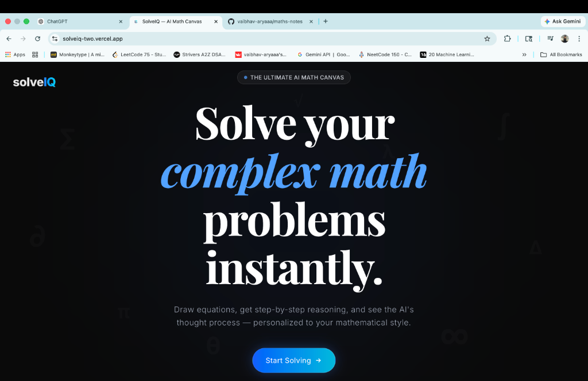
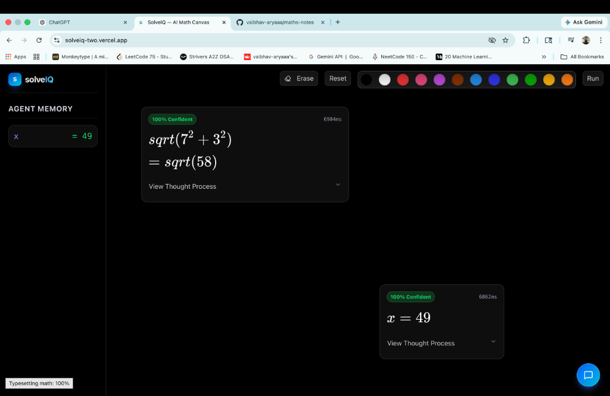
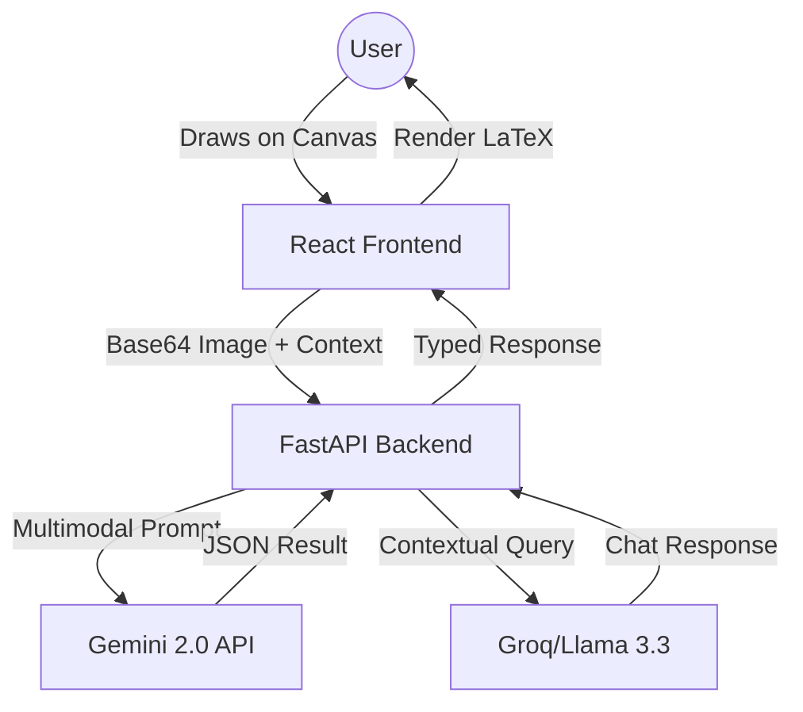

# 🌌 SolveIQ: AI-Powered Mathematical Intelligence Canvas



[](https://opensource.org/licenses/MIT)
[](https://fastapi.tiangolo.com/)
[](https://reactjs.org/)
[](https://deepmind.google/technologies/gemini/)

**SolveIQ** is a next-generation mathematical playground that bridges the gap between digital ink and artificial intelligence. Built with a high-performance FastAPI backend and a sleek, glassmorphic React frontend, SolveIQ allows users to draw mathematical problems directly onto a canvas and receive real-time, step-by-step solutions powered by state-of-the-art Large Multimodal Models (LMMs).

---

## 📸 Demo



---

## ✨ Key Features

- **🎨 Infinite Mathematical Canvas**: Draw equations, geometric shapes, and functions using a responsive, low-latency drawing interface.
- **🤖 Multi-Modal AI Solver**: Leverages **Google Gemini 2.0** and **Groq (Llama 3.3)** to interpret handwritten math, diagrams, and complex word problems.
- **💬 Math Co-Pilot**: An interactive chat interface that maintains session-aware context, allowing you to ask follow-up questions about specific steps or concepts.
- **🧠 Agentic Memory**: A state-management system that "remembers" variables (e.g., `x = 5`) across the canvas, enabling multi-step problem solving and constant-based calculations.
- **🧬 Transparent Reasoning**: View the AI's internal "Thought Process" and confidence scores for every solution.
- **📱 Responsive Glassmorphic UI**: A premium, dark-mode-first interface built with Mantine and TailwindCSS, designed for both desktop and tablet experiences.

---

## 🛠️ Tech Stack

### Frontend
- **Framework**: React 19 (Vite)
- **Language**: TypeScript
- **Styling**: TailwindCSS + Mantine UI
- **Canvas Engine**: HTML5 Canvas API
- **State Management**: React Hooks + Draggable UI
- **Icons**: Lucide React

### Backend
- **Framework**: FastAPI (Python)
- **AI Orchestration**: Google Generative AI (Gemini 2.0 Flash/Pro), Groq SDK
- **Processing**: Pillow (Image Processing), Pydantic (Data Validation)
- **Deployment**: Dockerized (Ready for Render/Vercel)

---

## 🚀 Getting Started

### Prerequisites
- Python 3.10+
- Node.js 18+
- API Keys for Google Gemini and Groq

### 1. Backend Setup
```bash
cd maths-note-be
python -m venv venv
source venv/bin/activate  # On Windows: venv\Scripts\activate
pip install -r requirements.txt
cp .env.example .env  # Add your API keys here
uvicorn main:app --reload
```

### 2. Frontend Setup
```bash
cd maths-note-fe
npm install
cp .env.example .env.local  # Point VITE_API_URL to your backend
npm run dev
```

---

## 🏗️ Architecture



---

## 🗺️ Roadmap & Future Enhancements

- [ ] **Multi-Modal Upload**: Paste screenshots or upload PDFs directly to the canvas.
- [ ] **Dynamic Graphing**: Render interactive 2D/3D plots for functions using Recharts.
- [ ] **Cloud Workspace**: Supabase integration for saving and sharing math notes.
- [ ] **WolframAlpha Integration**: For hyper-precise symbolic computation verification.

---

## 📄 License

Distributed under the MIT License. See `LICENSE` for more information.

---

<p align="center">
  Built with ❤️ by [Vaibhav Arya]
</p>
