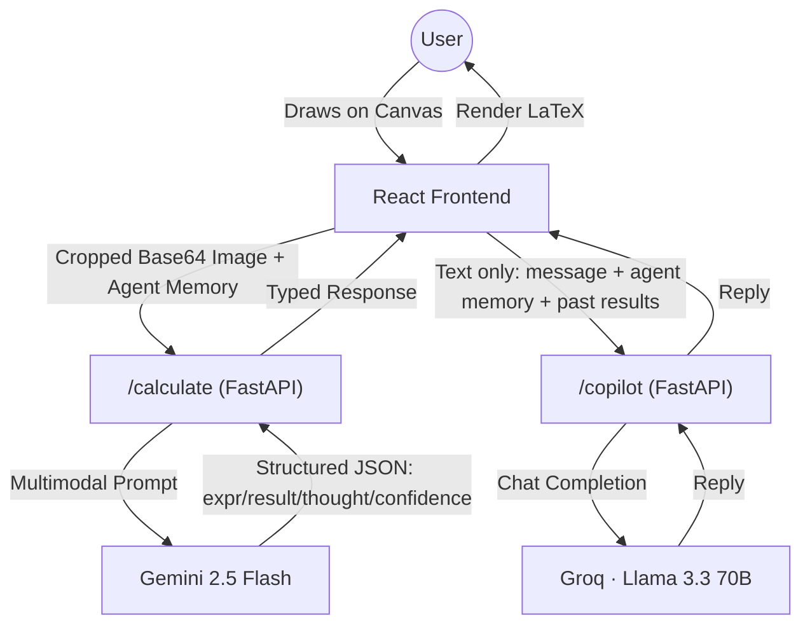

# 🌌 SolveIQ: AI-Powered Mathematical Intelligence Canvas


[](https://opensource.org/licenses/MIT)
[](https://fastapi.tiangolo.com/)
[](https://reactjs.org/)
[](https://deepmind.google/technologies/gemini/)

**SolveIQ** is a next-generation mathematical playground that bridges the gap between digital ink and artificial intelligence. Built with a high-performance FastAPI backend and a sleek, glassmorphic React frontend, SolveIQ allows users to draw mathematical problems directly onto a canvas and receive real-time, step-by-step solutions powered by state-of-the-art Large Multimodal Models (LMMs).

---

## 📸 Demo


---

## ✨ Key Features

- **🎨 Mathematical Canvas**: Draw equations, diagrams, and word problems with pen, eraser, and shape tools (line, rectangle, circle, triangle) on an HTML5 canvas, with mouse and touch support. Solved regions are auto-cropped (with padding) before being sent to the AI, so only the relevant area is analyzed.
- **🤖 AI Solver**: Sends the cropped canvas image to **Google Gemini 2.5 Flash**, which is prompted to classify the drawing into one of five cases (simple expressions, equation systems, variable assignment, graphical/word problems, or abstract concepts) and return a structured JSON result with a thought process and confidence score.
- **💬 Math Co-Pilot Chat**: A session-aware follow-up chat powered by **Groq (Llama 3.3 70B)**. It's currently **text-only** — it reasons over the Agent Memory and the AI's past solved results (expression, answer, thought process), but does not see the live canvas image. Chat history is kept in an in-memory session store on the backend, so it resets on server restart/redeploy.
- **🧠 Agentic Memory**: A client-side state system that "remembers" variables (e.g., `x = 5`) whenever the AI marks a result as an assignment, feeding them back into future canvas solves.
- **🧬 Transparent Reasoning**: Draggable, resizable result cards show the AI's "Thought Process" and confidence score, and report per-request latency.
- **📱 Responsive Glassmorphic UI**: A dark-mode-first interface built with Mantine, TailwindCSS, and shadcn/Radix components, with an animated canvas/CSS-based 3D-style background.

---

## 🛠️ Tech Stack

### Frontend
- **Framework**: React 19 (Vite)
- **Language**: TypeScript
- **Styling**: TailwindCSS v4 + Mantine UI + shadcn/Radix UI primitives
- **Canvas Engine**: HTML5 Canvas API (single-file implementation in `screens/home`), plus a hand-rolled canvas/CSS animated background (no Three.js)
- **Math Rendering**: MathJax, loaded dynamically via a `<script>` tag at runtime (not an npm package)
- **State Management**: React Hooks, `react-draggable` for result cards
- **Routing**: react-router-dom
- **HTTP**: axios
- **Icons**: Lucide React

### Backend
- **Framework**: FastAPI (Python)
- **AI Orchestration**: `google-generativeai` calling **`gemini-2.5-flash`** for image solving; `groq` SDK calling **`llama-3.3-70b-versatile`** for the copilot chat (in-memory session store, no database)
- **Processing**: Pillow (Image Processing), Pydantic (Data Validation)
- **Deployment**: Dockerized (Ready for Render/Vercel)

---

## 🚀 Getting Started

### Prerequisites
- Python 3.10+
- Node.js 18+
- API Keys for Google Gemini and Groq

### 1. Backend Setup
```bash
cd maths-note-be
python -m venv venv
source venv/bin/activate  # On Windows: venv\Scripts\activate
pip install -r requirements.txt
cp .env.example .env  # Add your API keys here
uvicorn main:app --reload
```

### 2. Frontend Setup
```bash
cd maths-note-fe
npm install
cp .env.example .env.local  # Point VITE_API_URL to your backend
npm run dev
```

---

## 🏗️ Architecture



> Note: the Co-Pilot does **not** currently receive the canvas image — it answers using only the text of past solved results and the Agent Memory dictionary.

---

## 🔒 API Specifications & Security

### Request Size Limit
*   The API enforces a global request body limit of **8 MB**. Any request exceeding this limit will immediately return a `413 Payload Too Large` error.

### Error Handling & Validation
*   All routes implement consistent request body validation. If a request body is malformed or violates schema validation (e.g. invalid base64 image strings), the server will return a clean and structured `422 Unprocessable Content` response containing validation details:
    ```json
    {
      "detail": "Request validation failed",
      "errors": [
        {
          "field": "image",
          "message": "Value error, Image string cannot be empty",
          "type": "value_error"
        }
      ]
    }
    ```

---

## 🗺️ Roadmap & Future Enhancements

- [ ] **Copilot Canvas Vision**: Give the Co-Pilot the actual canvas image (via Gemini) instead of text-only context, so it can genuinely reason about what's drawn.
- [ ] **Persistent Chat Sessions**: Replace the in-memory `_sessions` dict with real storage (e.g. Redis/Postgres) so copilot history survives redeploys.
- [ ] **Multi-Modal Upload**: Paste screenshots or upload PDFs directly to the canvas.
- [ ] **Dynamic Graphing**: Render interactive 2D/3D plots for functions using Recharts.
- [ ] **Cloud Workspace**: Supabase integration for saving and sharing math notes.
- [ ] **WolframAlpha Integration**: For hyper-precise symbolic computation verification.

---

## 📄 License

Distributed under the MIT License. See `LICENSE` for more information.

---

<p align="center">
  Built with ❤️ by [Vaibhav Arya]
</p>