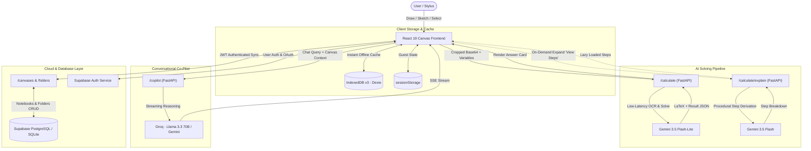

# SolveIQ: AI-Powered Mathematical Intelligence Canvas & Workspace

[](https://github.com/vaibhav-aryaaa/maths-notes/actions/workflows/ci.yml)
[](./LICENSE)
[](https://reactjs.org/)
[](https://fastapi.tiangolo.com/)
[](https://deepmind.google/technologies/gemini/)
[](https://supabase.com/)

[**🚀 Live Application**](https://solveiq-two.vercel.app)

---

## What is SolveIQ?

**SolveIQ** is a full-featured, AI-native mathematical workspace that bridges digital handwriting, vector canvas sketching, and Large Multimodal Models (LMMs).

Unlike single-shot camera calculators (Photomath, Mathway) that treat math as a one-off scan from a phone lens, SolveIQ is built as an **active, persistent digital whiteboard**:

1. **Persistent Multi-Canvas Notebooks**: Organize equations, proofs, and lecture notes across hierarchical folders, rather than throwing everything onto an ephemeral scratchpad.
2. **Tiered AI Intelligence**: Fast, low-latency parsing (`gemini-3.5-flash-lite`) for instant math solutions, paired with on-demand procedural explanations (`gemini-3.5-flash`) that only load when you need them.
3. **Conversational Math Co-Pilot (Vector)**: A streaming conversational assistant that maintains full context of your canvas formulas, assigned variables, and previous derivations.
4. **Offline-First Resilience & Cloud Sync**: Draw freely offline with instant IndexedDB v3 local caching, seamless background cloud synchronization, and automatic guest-to-account notebook migration.

---

## Key Features

### 📁 1. Notebooks & Organization
* **Modern Library (`/library`)**: Centralized dashboard to view, search, filter, and organize all notebooks with both Grid and List layouts.
* **Hierarchical Folders**: Two-level folder categorization (CollaNote-style) to organize homework, courses, and research topics.
* **Trash & Soft-Delete**: Safe deletion lifecycle with dedicated Trash management for instant restoration or permanent deletion.

### 2. Mathematical Canvas Engine
* **Infinite Viewport**: 12,000 × 12,000 coordinate workspace with smooth pan, trackpad pinch zoom, touch gestures, and grid toggling.
* **Vector Pen System**: Specialized inking tools including **Pen**, **Fountain Pen**, **Marker**, and blend-aware **Highlighter** with custom stroke widths and opacities.
* **Continuous Gradient Color Picker**: Dynamic gradient selector alongside an adaptive dark/light mode palette.
* **Geometric Shapes**: Interactive drawing of lines, rectangles, circles, and arrows.
* **Multi-Modal Content**: Rich text boxes and image insertion supporting drag-and-drop, clipboard paste, and on-demand HEIC decoding.
* **Object Selection & Manipulation**: Marquee/lasso selection, drag repositioning, resize handles, and full **Copy / Paste / Duplicate (`Ctrl+C`, `Ctrl+V`, `Ctrl+D`)** with single-step undo.
* **Clean State UX**: Derived undo/redo engine that prevents jarring onboarding popups during active sketching sessions.

### 3. AI Solving Engine
* **Two-Tiered Fast / Detailed Split**:
  * **Fast Path (`/calculate`)**: Uses `gemini-3.5-flash-lite` to instantly identify handwritten math, evaluate expressions, solve equations, and render interactive LaTeX answer cards in $<2$s.
  * **On-Demand Explanation Path (`/calculate/explain`)**: When expanding "View Thought Process", `gemini-3.5-flash` lazily generates structured step-by-step procedural derivations without slowing down the initial solve.
* **Variable Dependency Memory**: Client-side agentic memory that tracks assignments (e.g. $x = 10 \implies 2x + y = 30$) across multiple equations.
* **Targeted Region Solving**: Solve tool with Rectangle or Lasso modes to isolate specific calculations on a crowded canvas.
* **Zero-Waste Guards**: Aborts execution with friendly alerts on empty selections or blank canvases to save API compute.

### 4. Vector: Conversational Math Co-Pilot
* **Context-Aware Sidebar**: Streaming chat assistant powered by Groq (Llama 3.3 70B) and Gemini.
* **Grounding in Session State**: Vector receives the full context of all active canvas variables, solved formulas, and history entries to answer questions like *"Why did we use the substitution method in step 2?"*.

### 5. Accounts, Sync & Guest Mode
* **Guest Mode**: Try the app instantly without an account. Includes a 5-solve limit, isolated `sessionStorage` persistence, and zero backend writes.
* **Seamless Migration**: Mid-session sign-up or sign-in automatically migrates guest strokes, answer cards, and camera offsets into a new notebook in the user's permanent account.
* **Full Authentication**: Supabase Auth (Email/Password + Google OAuth), password recovery, and secure JWKS token verification.
* **Cross-Device Sync**: IndexedDB v3 client caching with background synchronization to Supabase PostgreSQL.

### 6. Production Engineering
* **PWA Optimization**: Service Worker with lazy-loaded WASM HEIC chunk, reducing initial install precache size by ~1.32 MB.
* **Route Code Splitting**: `React.lazy()` chunking on `/library`, `/share`, and `/reset-password` routes.
* **Security & Rate Limiting**: Global request size limits (8 MB) and per-IP endpoint rate limiting via `slowapi`.
* **Telemetry & Monitoring**: Optional Sentry error tracking and privacy-focused PostHog event analytics.
* **Testing Suite**: 65+ automated frontend unit tests (Vitest) and backend test suites.

---

## Architecture


```mermaid
flowchart TD
    User([User / Stylus]) -->|Draw / Sketch / Select| FE[React 19 Canvas Frontend]

    subgraph Client [Client Storage & Cache]
        FE <-->|Instant Offline Cache| IDB[(IndexedDB v3 - Dexie)]
        FE <-->|Guest State| SS[(sessionStorage)]
    end

    subgraph AI_Engine [AI Solving Pipeline]
        FE -->|Cropped Base64 + Variables| API_Calc["/calculate (FastAPI)"]
        API_Calc -->|Low-Latency OCR & Solve| GeminiFast["Gemini 3.5 Flash-Lite"]
        GeminiFast -->|LaTeX + Result JSON| API_Calc
        API_Calc -->|Render Answer Card| FE

        FE -.->|On-Demand Expand 'View Steps'| API_Explain["/calculate/explain (FastAPI)"]
        API_Explain -->|Procedural Step Derivation| GeminiExplain["Gemini 3.5 Flash"]
        GeminiExplain -->|Step Breakdown| API_Explain
        API_Explain -.->|Lazy Loaded Steps| FE
    end

    subgraph Copilot_Engine [Conversational Co-Pilot]
        FE -->|Chat Query + Canvas Context| API_Copilot["/copilot (FastAPI)"]
        API_Copilot -->|Streaming Reasoning| GroqLlama["Groq · Llama 3.3 70B / Gemini"]
        GroqLlama -->|SSE Stream| FE
    end

    subgraph Cloud_Backend [Cloud & Database Layer]
        FE <-->|JWT Authenticated Sync| API_Canvases["/canvases & /folders"]
        API_Canvases <-->|Notebooks & Folders CRUD| Postgres[(Supabase PostgreSQL / SQLite)]
        FE <-->|User Auth & OAuth| SupabaseAuth[Supabase Auth Service]
    end
```

---

## Tech Stack

| Layer | Technology | Version / Model | Purpose |
| :--- | :--- | :--- | :--- |
| **Frontend** | React | 19.x | Component UI architecture |
| **Build Tool** | Vite | 8.x | High-speed bundling & HMR |
| **Language** | TypeScript | 5.x | Type safety across models & events |
| **UI & Styling** | Tailwind CSS + Mantine | v4 / Mantine v7 | Styling, dialogs, color picker, notifications |
| **Inking Engine** | HTML5 Canvas + Custom Splines | Custom | Multi-tool vector stroke engine with pinch/pan |
| **Local Storage** | IndexedDB / Dexie.js | v3 | Offline-first canvas persistence & metadata |
| **Backend API** | FastAPI | Python 3.10+ | High-performance async REST API |
| **Fast Math AI** | Google Gemini | `gemini-3.5-flash-lite` | Instant multimodal math OCR and calculation |
| **Explain AI** | Google Gemini | `gemini-3.5-flash` | On-demand procedural step-by-step explanations |
| **Co-Pilot AI** | Groq / Llama | `llama-3.3-70b-versatile` | Contextual conversational math assistant |
| **Database & Auth** | Supabase | PostgreSQL 15 | Cloud notebooks, folders, and JWT auth |
| **PWA & Offline** | Vite PWA / Workbox | 1.3.x | Service worker caching & installable web app |
| **Testing** | Vitest + React Testing Library | 4.x | Unit and component testing suite |

---

## Getting Started

### Prerequisites
* **Node.js**: 18.0 or newer
* **Python**: 3.10 or newer
* **Google Gemini API Key**: [Get a Gemini API key](https://aistudio.google.com/)
* *(Optional)* **Supabase Project**: [Create a free Supabase project](https://supabase.com/) for cloud accounts & sync (the app runs 100% in Guest Mode without Supabase).
* *(Optional)* **Groq API Key**: [Get a Groq API key](https://console.groq.com/) for the Co-Pilot.

---

### 1. Backend Setup (`maths-note-be`)

1. Navigate to the backend directory:
   ```bash
   cd maths-note-be
   ```
2. Create and activate a Python virtual environment:
   ```bash
   python -m venv venv
   source venv/bin/activate  # On Windows: venv\Scripts\activate
   ```
3. Install dependencies:
   ```bash
   pip install -r requirements.txt
   ```
4. Configure environment variables:
   ```bash
   cp .env.example .env
   ```
5. Start the FastAPI server:
   ```bash
   uvicorn main:app --host 0.0.0.0 --port 8900 --reload
   ```

---

### 2. Frontend Setup (`maths-note-fe`)

1. Navigate to the frontend directory:
   ```bash
   cd maths-note-fe
   ```
2. Install npm dependencies:
   ```bash
   npm install
   ```
3. Configure environment variables:
   ```bash
   cp .env.example .env.local
   ```
4. Start the Vite development server:
   ```bash
   npm run dev
   ```
5. Open your browser at `http://localhost:5173`.

---

## Environment Variables Reference

### Frontend (`maths-note-fe/.env.local`)

| Variable | Required | Default | Description |
| :--- | :---: | :--- | :--- |
| `VITE_API_URL` | **Yes** | `http://localhost:8900` | URL of the running FastAPI backend |
| `VITE_APP_KEY` | **Yes** | — | Shared secret header (`X-App-Key`) matching backend `APP_SECRET` |
| `VITE_SUPABASE_URL` | No | — | Supabase project URL (enables account sign-in & cloud sync) |
| `VITE_SUPABASE_ANON_KEY` | No | — | Supabase public anonymous API key |
| `VITE_SENTRY_DSN` | No | — | Sentry DSN for frontend crash reporting |
| `VITE_POSTHOG_KEY` | No | — | PostHog public project key for anonymous telemetry |
| `VITE_POSTHOG_HOST` | No | `https://us.i.posthog.com` | PostHog telemetry ingestion host |

> 💡 **Note**: If `VITE_SUPABASE_URL` is omitted, SolveIQ automatically runs in **Guest Mode**, allowing full canvas usage and local problem solving without requiring a database.

---

### Backend (`maths-note-be/.env`)

| Variable | Required | Default | Description |
| :--- | :---: | :--- | :--- |
| `APP_SECRET` | **Yes** | — | Shared gateway secret key verified on API requests |
| `GEMINI_API_KEY` | **Yes** | — | Google Gemini API key for multimodal solving |
| `DATABASE_URL` | No | SQLite (`shares.db`) | PostgreSQL connection string (e.g. Supabase DB URL) |
| `SUPABASE_URL` | No | — | Supabase project URL for JWT JWKS token decoding |
| `SUPABASE_ANON_KEY` | No | — | Supabase API key for public key verification |
| `GROQ_API_KEY` | No | — | Groq API key for Llama 3.3 Co-Pilot chat |
| `ALLOWED_ORIGINS` | No | `https://solveiq-two.vercel.app,http://localhost:5173` | Allowed CORS origins |
| `GEMINI_MODEL_FAST` | No | `gemini-3.5-flash-lite` | Model identifier for fast math recognition |
| `GEMINI_MODEL_EXPLAIN` | No | `gemini-3.5-flash` | Model identifier for step-by-step reasoning |
| `SENTRY_DSN` | No | — | Sentry DSN for backend exception tracking |

---

## Project Structure

```
math-note/
├── LICENSE                     # MIT License
├── README.md                   # Project documentation
├── future.md                   # Feature exploration & roadmap
├── docker-compose.yml          # Container configuration
│
├── maths-note-fe/              # React 19 Frontend
│   ├── src/
│   │   ├── components/         # Reusable UI (DraggableResultCard, CopilotPanel, ColorPicker)
│   │   ├── data/               # Preset math onboarding examples
│   │   ├── hooks/              # Custom hooks (useSolveHistory)
│   │   ├── lib/                # Supabase client, IndexedDB persistence, Analytics
│   │   ├── screens/
│   │   │   ├── home/           # Main whiteboard canvas & hook architecture
│   │   │   ├── landing/        # Interactive landing page curtain
│   │   │   ├── library/        # Multi-notebook & folder workspace
│   │   │   ├── reset-password/ # Password recovery screen
│   │   │   └── share/          # Read-only snapshot viewer
│   │   ├── App.tsx             # Root router with Suspense code splitting
│   │   └── main.tsx            # Entry point with Sentry & PostHog init
│   ├── vite.config.ts          # Vite & PWA Workbox configuration
│   └── package.json
│
└── maths-note-be/              # FastAPI Python Backend
    ├── apps/
    │   ├── calculator/         # Fast solve & lazy explanation endpoints
    │   ├── canvases/           # Notebooks & folders CRUD routes
    │   ├── copilot/            # Streaming conversational chat routes
    │   ├── history/            # Canvas solve history endpoints
    │   └── share/              # Public share snapshot generation
    ├── auth.py                 # JWT validation & JWKS key provider
    ├── db.py                   # PostgreSQL / SQLite connection layer
    ├── rate_limiter.py         # Slowapi rate limiting
    ├── main.py                 # FastAPI application root & middleware
    └── requirements.txt
```

---

## Roadmap & Current Focus

See [future.md](./future.md) for upcoming architecture plans and exploratory features:

- [x] **Notebooks & Folders Workspace**
- [x] **Guest Mode Rework & Account Migration**
- [x] **Skip AI Call on Empty Selection**
- [x] **Copy / Paste / Duplicate Canvas Elements**
- [x] **PWA Precache Reduction & Route Splitting**
- [ ] **Dynamic 2D/3D Function Plotting** (Interactive curves & graphs via Plotly / Desmos)
- [ ] **Multi-Page PDF Note Export** (Formatted export of canvas, formulas, and derivations)
- [ ] **Apple Pencil Pressure & Stylus Dynamics** (`PointerEvent.pressure` sensitivity)
- [ ] **Realtime Multiplayer Collaboration** (Live co-editing via WebSockets / Supabase Realtime)

---

## Privacy & Data Policy

SolveIQ is designed with data minimization:
* **No Raw Drawing Capture**: Stroke coordinates and raw canvas drawings are never recorded into telemetry.
* **Ephemeral Processing**: Base64 image crops sent to the `/calculate` endpoint are processed in memory and never written to disk or stored on backend servers.
* **Opt-Out Telemetry**: PostHog telemetry is strictly diagnostic (e.g. error counts, solve latency) and can be disabled completely by omitting `VITE_POSTHOG_KEY`.

---

## 📄 License

This project is licensed under the MIT License — see the [LICENSE](./LICENSE) file for details.

<p align="center">
  Built with ❤️ by <a href="https://github.com/vaibhav-aryaaa">Vaibhav Arya</a>
</p>